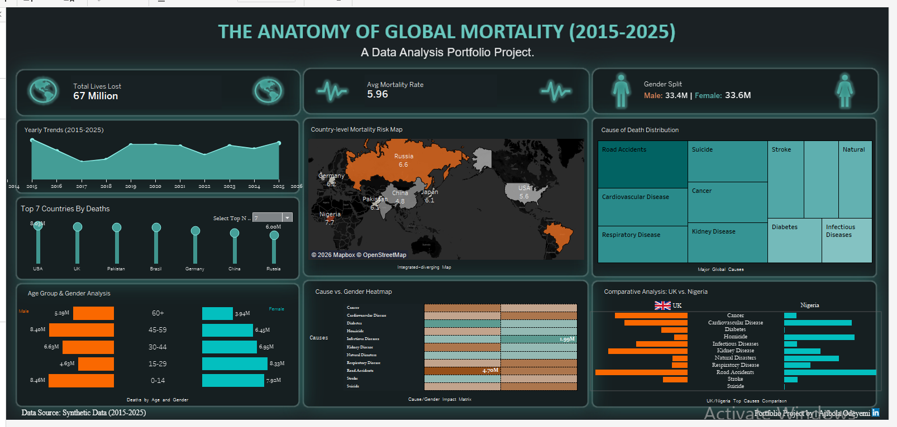
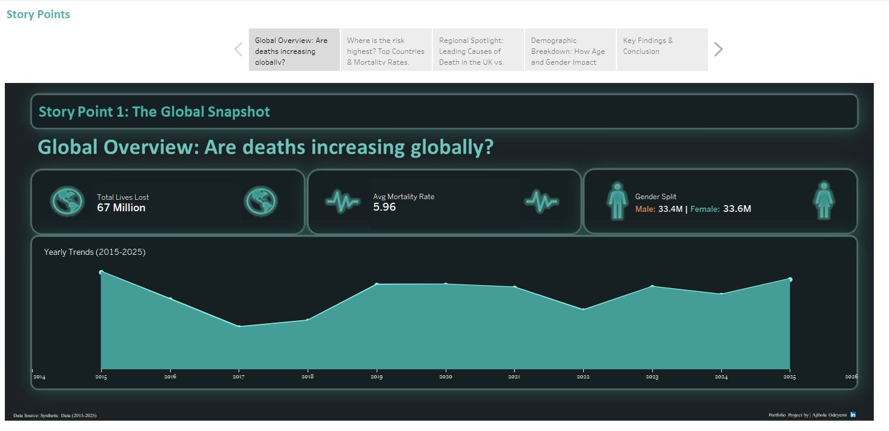
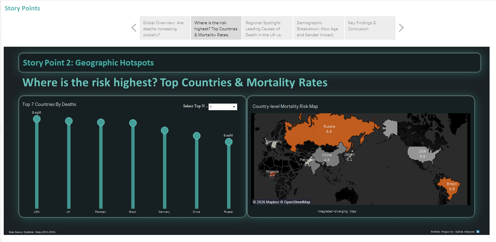
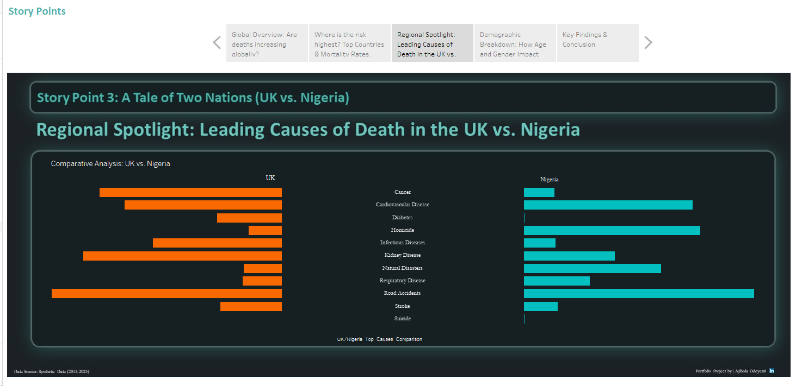
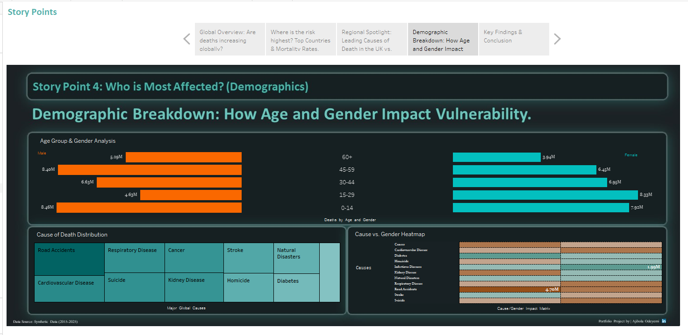
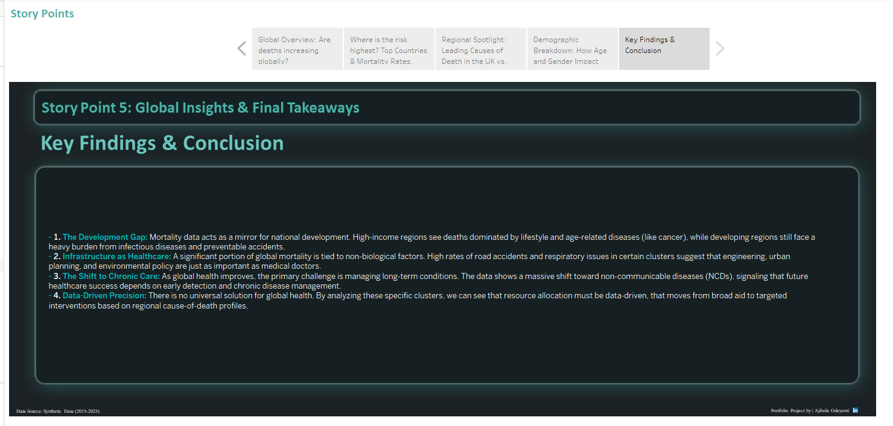

# The Anatomy of Global Mortality (2015-2025) 

## Project Overview
This project transforms a raw synthetic dataset into an interactive Tableau dashboard designed to drive strategic understanding of global health vulnerabilities. The objective of this build is to serve as an analytical tool that identifies mortality trends, maps geographic risks, and pinpoints the underlying socio-economic factors driving causes of death globally. 

**Live Interactive Dashboard:** https://public.tableau.com/views/TheAnatomyofGlobalMortality/Dashboard1?:language=en-US&:sid=&:redirect=auth&:display_count=n&:origin=viz_share_link

**LinkedIn Profile:** https://www.linkedin.com/in/ajibola-odeyemi-6b6502381

## The Analytical Problem
The core mission of this analysis was to answer three primary questions to guide global health strategy and resource allocation:
*   **Geographic Risk:** Where are mortality rates the highest, and what anomalies exist between neighboring regions?
*   **Demographic Vulnerability:** Who is most at risk? How do age and gender influence the likelihood of specific causes of death?
*   **The Development Gap:** How do causes of death differ fundamentally between developed and developing nations, and what does this mean for infrastructure and healthcare investment?

## Technical Stack & Data Architecture
*   **Data Visualization & Modeling:** Engineered in Tableau using dynamic parameters, custom calculated fields, and advanced chart types (Diverging Bar/Butterfly charts, Integrated Maps).
*   **Data Structure:** The analysis is built on a synthetic dataset (`global_mortality_data.csv`) encompassing 10 years of data, structured to allow seamless drill-downs across Year, Country, Gender, Age Group, and Cause of Death.
*   **UX/UI Design:** Designed a dark-mode, high-contrast interface prioritizing data-ink ratio. Utilized Tableau Story Points to create a guided, narrative-driven presentation for stakeholders.

## Key Strategic Insights
*   **The Development Gap:** High-income regions see deaths dominated by lifestyle and age-related diseases, while developing regions face a heavy burden from infectious diseases. 
*   **Infrastructure as Healthcare:** High rates of road accidents and respiratory issues in specific clusters suggest that urban planning and environmental policy are critical health interventions.
*   **The Shift to Chronic Care:** The data shows a massive shift toward non-communicable diseases (NCDs), signaling a need for capital reallocation toward early detection and chronic disease management.

---

## Dashboard Previews & Technical Walkthrough

### 1. The Executive Overview
This high-level view tracks the global performance over a decade, capturing the total **67 Million** lives lost. Designed to be completely uncluttered, it gives leadership instant access to top-line metrics, an integrated-diverging risk map, and macro-level distributions.

### 2. Global Macro Trends
The first story point establishes the baseline. By plotting yearly trends (2015-2025), analysts can immediately spot peaks and valleys in the global mortality rate, tracking the overarching trajectory before drilling into specifics.

### 3. Geographic Hotspots & Risk Mapping
This view shifts focus to geographic concentration. By utilizing a dynamic "Top N" parameter, the user can filter the bar chart to isolate the most heavily impacted nations. The accompanying heat map provides immediate visual context regarding regional risk density.

### 4. Regional Spotlight: The UK vs. Nigeria
This is the comparative engine of the dashboard. Using a diverging bar chart, this view directly contrasts a developed nation (UK) with a developing nation (Nigeria). It visually proves the "Development Gap" hypothesis, showing a stark contrast in primary causes of death.

### 5. Demographic Breakdown & Heatmapping
This section focuses on the granular details of vulnerability. The butterfly chart splits the data cleanly by gender and age group, while the cross-matrix heatmap allows for rapid identification of which specific demographics are most susceptible to distinct causes of death.

### 6. Final Takeaways
A concluding executive summary that translates the visual data back into actionable, text-based strategic insights for non-technical stakeholders.

---
*Built to translate complex data into clear, actionable business narratives.*